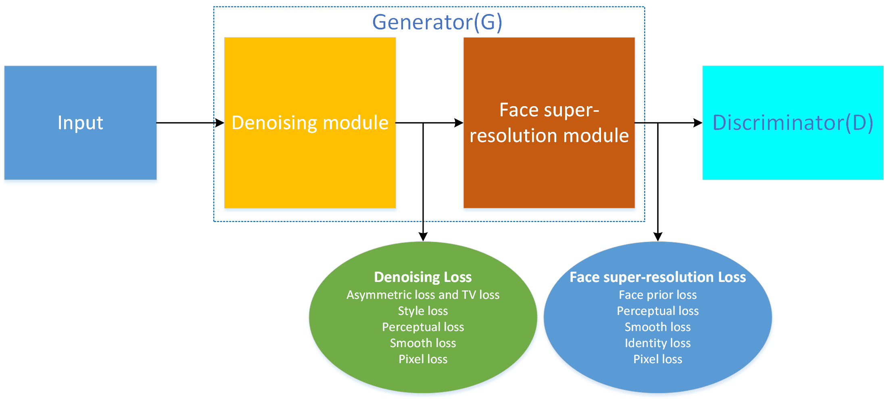

# JDSR-GAN
Lei Tang, Guangwei Gao, Yi Yu,  Fei Wu, Huimin Lu and Jian Yang, JDSR-GAN: Constructing A Joint and Collaborative Learning Network for Masked Face Super-Resolution

## Overview

> **A Joint and Collaborative Learning Network for Masked Face Super-Resolution** 
>Lei Tang (NJUPT), Guangwei Gao (NJUPT), et al. 
> **Abstract:** *With the growing importance of preventing the COVID-19 virus, face images obtained in
most video surveillance scenarios are low resolution with mask simultaneously. However,
most of the previous face super-resolution solutions can not handle both tasks in one model.
In this work, we treat the mask occlusion as image noise and construct a joint and collaborative learning network, called JDSR-GAN, for the masked face super-resolution task. Given
a low-quality face image with the mask as input, the role of the generator composed of a
denoising module and super-resolution module is to acquire a high-quality high-resolution
face image. The discriminator utilizes some carefully designed loss functions to ensure the
quality of the recovered face images. Moreover, we incorporate the identity information
and attention mechanism into our network for feasible correlated feature expression and
informative feature learning. By jointly performing denoising and face super-resolution, the
two tasks can complement each other and attain promising performance. Extensive qualitative and quantitative results show the superiority of our proposed JDSR-GAN over some
comparable methods which perform the previous two tasks separately.*.

### Prerequisites
* Python 3.6
* Pytorch 1.2.0
* CUDA 10.1 or higher

This code support [NVIDIA apex-Distributed Training in Pytorch](https://github.com/NVIDIA/apex), please follow description. 

### Data Preparation

* [CelebA dataset](http://mmlab.ie.cuhk.edu.hk/projects/CelebA.html)

#### Demonstration

#### Test model

## Citation

